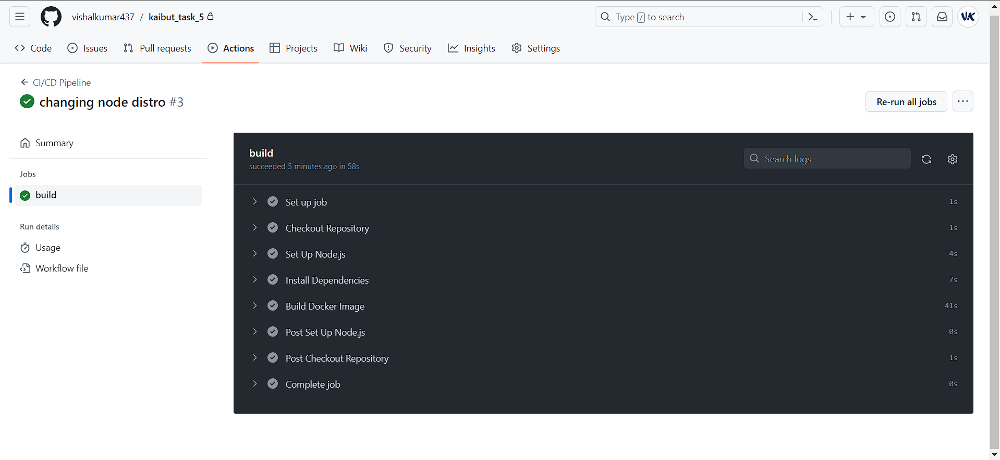

# Kaiburr Task 5




Workflow file can be found in 

```./github/workflows/build_and_test.yml```

Also build Dockerimage using nodejs v20.

Used Github Actions for CodePipeline.
Can be checked in Actions.

## Getting Started

First, run the development server:

```bash
npm run dev
# or
yarn dev
# or
pnpm dev
# or
bun dev
```

Open [http://localhost:3000](http://localhost:3000) with your browser to see the result.
